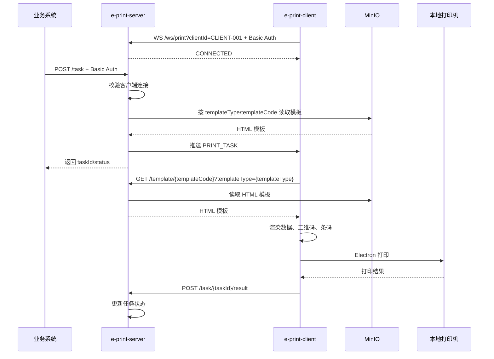

# e-print

## 目录

1. [概述](#1-概述)
2. [项目结构](#2-项目结构)
3. [时序图](#3-时序图)
4. [项目模块](#4-项目模块)
   4.1 [e-print-client](#41-e-print-client)
   4.2 [e-print-server](#42-e-print-server)
   4.3 [e-print-admin](#43-e-print-admin)
   4.4 [本地依赖](#44-本地依赖)

## 1. 概述

`e-print` 是企业级本地打印桥接方案，由打印任务服务、本地打印客户端和模板管理后台组成。

业务系统通过 HTTP 创建打印任务，`e-print-server` 通过 WebSocket 推送给指定的 `e-print-client`；客户端下载 HTML 模板、渲染业务数据和条码二维码，并调用本地打印机完成打印。`e-print-admin` 负责维护模板类型、模板元数据和模板文件。

## 2. 项目结构

```text
e-print
├── e-print-client      # Electron 本地打印客户端
├── e-print-server      # Spring Boot 打印任务服务
├── e-print-admin       # Spring Boot MVC 模板管理后台
├── db                  # Oracle 初始化脚本
└── minio               # 本地 MinIO 配置和模板资源
```

| 路径 | 说明 |
| --- | --- |
| `e-print-client` | 本地打印桥接器，连接服务端并执行打印 |
| `e-print-server` | 打印任务 API、WebSocket 推送、模板读取服务 |
| `e-print-admin` | 模板类型和 HTML 模板管理后台 |
| `db/oracle` | Oracle 表、序列、索引和初始化数据脚本 |
| `minio` | Docker Compose、bucket 初始化和示例模板 |

## 3. 时序图



## 4. 项目模块

### 4.1 e-print-client

简介：本地打印桥接器。[详细文档](./e-print-client/README.md)

技术栈：

| 分类 | 技术 |
| --- | --- |
| 运行时 | Node.js 18+、npm 9+ |
| 桌面端 | Electron |
| 通信 | WebSocket、Basic Auth |
| 模板渲染 | Handlebars |
| 条码二维码 | qrcode、bwip-js |
| 打包 | electron-builder |

启动：

```bash
cd e-print-client
npm install
npm start
```

### 4.2 e-print-server

简介：打印任务和推送服务。[详细文档](./e-print-server/README.md)

技术栈：

| 分类 | 技术 |
| --- | --- |
| 运行时 | Java 21 |
| 后端框架 | Spring Boot、niko-boot |
| 接口与推送 | Spring MVC、WebSocket、Spring Security |
| 数据访问 | MyBatis、HikariCP、Oracle |
| 模板存储 | MinIO |
| 工程工具 | Maven、MapStruct、Lombok |
| 可观测性 | Spring Boot Actuator、SpringDoc、Graylog |

启动：

```bash
cd e-print-server
mvn spring-boot:run
```

默认地址：

```text
http://localhost:9090
```

### 4.3 e-print-admin

简介：模板管理后台。[详细文档](./e-print-admin/README.md)

技术栈：

| 分类 | 技术 |
| --- | --- |
| 运行时 | Java 21 |
| 后端框架 | Spring Boot、Spring MVC |
| 页面模板 | Thymeleaf、Bootstrap Table |
| 安全 | Spring Security |
| 数据访问 | MyBatis、HikariCP、Oracle |
| 文件存储 | MinIO |
| 工程工具 | Maven、MapStruct、Lombok |
| 日志 | Graylog |

启动：

```bash
cd e-print-admin
mvn spring-boot:run
```

默认地址：

```text
http://localhost:9091
```

默认账号：

```text
eprint / eprint123
```

### 4.4 本地依赖

启动业务模块前，通常需要先启动 MinIO，并按 `db/oracle/print_template.sql` 初始化 Oracle 模板表。

启动 MinIO：

```bash
docker compose -f minio/docker-compose.minio.yml up -d
```

停止 MinIO：

```bash
docker compose -f minio/docker-compose.minio.yml down
```

MinIO 默认配置：

| 项 | 值 |
| --- | --- |
| S3 API | `http://localhost:9000` |
| 控制台 | `http://localhost:9001` |
| Access Key | `eprint_minio` |
| Secret Key | `eprint_minio_123` |
| Bucket | `e-print` |
