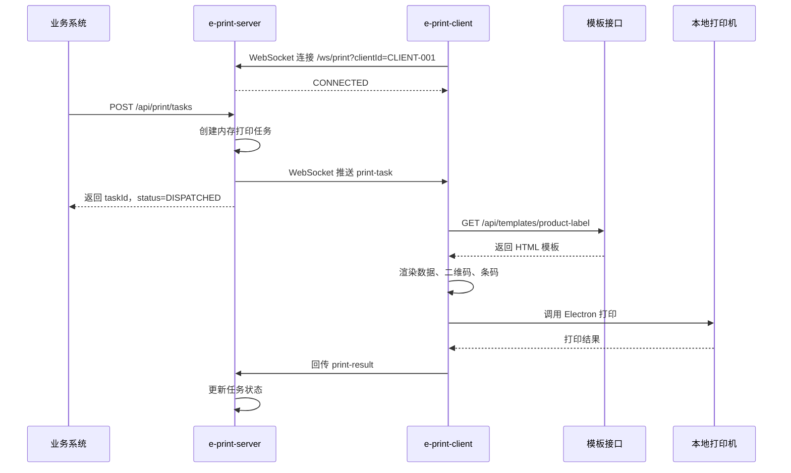

# e-print

企业级本地打印解决方案。

支持：

- 本地静默打印
- 标签打印
- 二维码打印
- HTML 模板打印

---

# 项目结构

```text
e-print
├── e-print-client
├── e-print-server
└── e-print-admin
```

| 模块 | 技术栈 | 功能 |
|---|---|---|
| e-print-client | Node.js + Electron | 本地打印客户端 |
| e-print-server | Spring Boot | 打印服务 |
| e-print-admin | 待定 | 模板管理后台 |

---

# 架构

```text
业务系统
    ↓ REST API
e-print-server
    ↓ WebSocket
e-print-client
    ↓
本地打印机
```

---

# e-print-client

功能：

- 配置本地打印机
- 连接 e-print-server
- 接收打印任务
- 下载打印模板
- 生成二维码 / 条码
- HTML 渲染
- 静默打印
- 回传打印结果

---

# e-print-server

功能：

- 提供打印 API
- 管理 WebSocket 连接
- 下发打印任务
- 提供模板接口
- 接收打印结果

---

# e-print-admin

功能：

- 模板管理
- 模板预览
- 模板发布

---

# 打印流程

```text
业务系统创建打印任务
        ↓
e-print-server
        ↓
WebSocket 推送
        ↓
e-print-client
        ↓
下载模板
        ↓
生成二维码
        ↓
HTML 渲染
        ↓
静默打印
```

---

# 打印任务示例

```json
{
  "clientId": "CLIENT-001",
  "templateCode": "product-label",
  "copies": 1,
  "data": {
    "productName": "MacBook Pro",
    "sku": "MBP-001",
    "price": "19999",
    "qrText": "https://example.com/p/MBP-001",
    "barcodeText": "MBP-001"
  }
}
```

---

# 测试用例说明

## 前置条件

- `e-print-server` 已启动，例如：`http://localhost:9090`
- `e-print-client` 已启动，并连接到：`ws://localhost:9090/ws/print`
- `e-print-client/config.json` 中 `clientId` 为 `CLIENT-001`
- 如需观察打印弹窗，将 `silent` 设置为 `false`

## 用例：创建商品标签打印任务

目标：

- 业务系统通过 HTTP 创建打印任务
- `e-print-server` 根据 `clientId` 将任务推送给指定 `e-print-client`
- `e-print-client` 下载 `product-label` 模板，渲染商品信息、二维码和条码
- 本地打印机执行打印，并由客户端回传结果

请求：

```text
POST http://localhost:9090/api/print/tasks
Content-Type: application/json
```

请求体：

```json
{
  "clientId": "CLIENT-001",
  "templateCode": "product-label",
  "copies": 1,
  "data": {
    "productName": "MacBook Pro",
    "sku": "MBP-001",
    "price": "19999",
    "qrText": "https://example.com/p/MBP-001",
    "barcodeText": "MBP-001"
  }
}
```

预期结果：

- `code` 为 `200`
- 返回 `taskId`
- `status` 为 `DISPATCHED`
- 客户端弹出打印窗口或执行静默打印
- 打印完成后，任务状态更新为 `SUCCESS`

查询任务状态：

```text
GET http://localhost:9090/api/print/tasks/{taskId}
```

## 调用时序图



---

# 技术栈

## e-print-client

- Electron
- Node.js
- Handlebars
- qrcode
- bwip-js

## e-print-server

- Spring Boot
- WebSocket
- DB

---

# MVP

## 第一版功能

### e-print-client

- 打印机配置
- WebSocket 连接
- 标签打印
- 二维码打印
- 静默打印

### e-print-server

- 打印任务 API
- WebSocket 推送
- 模板接口

### e-print-admin

- 模板新增
- 模板编辑
- 模板预览
