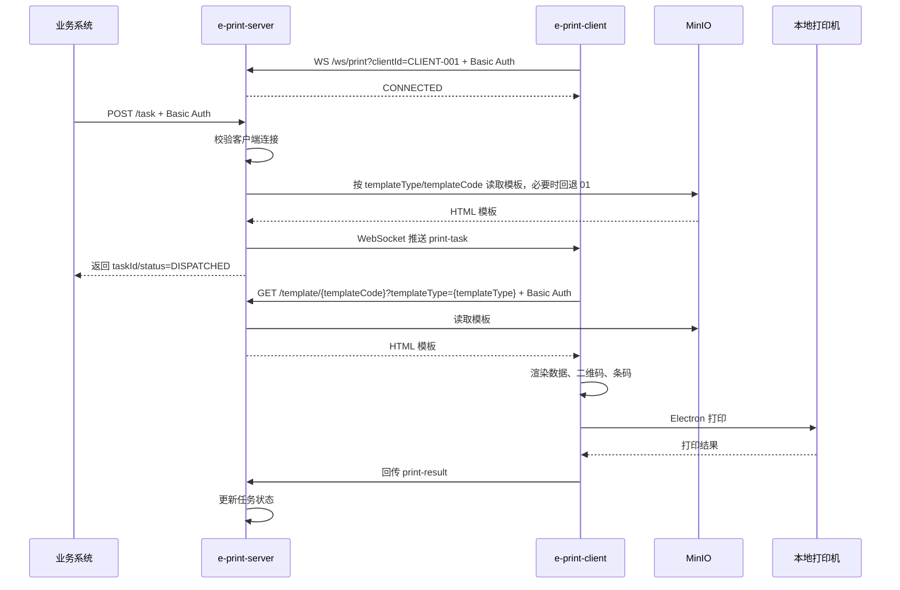

# e-print

企业级本地打印桥接方案。业务系统通过 HTTP 创建打印任务，`e-print-server` 将任务通过 WebSocket 推送给指定的 `e-print-client`，客户端在本机渲染 HTML 打印模板并调用本地打印机。

## 项目结构

```text
e-print
├── e-print-client      # Electron 本地打印客户端
├── e-print-server      # Spring Boot 打印服务
├── e-print-admin       # 模板管理后台
├── db                  # Oracle 初始化脚本
└── minio               # 本地 MinIO 配置和初始化资源
```

| 模块 | 技术栈 | 说明 |
| --- | --- | --- |
| `e-print-client` | Electron、Node.js、Handlebars、qrcode、bwip-js | 本地打印桥接器 |
| `e-print-server` | Spring Boot、niko-boot、WebSocket、MyBatis、Oracle、MinIO | 打印任务服务 |
| `e-print-admin` | Spring Boot MVC、Thymeleaf、Bootstrap Table、Oracle、MinIO | 模板管理后台 |

## 调用链路

```text
业务系统
  -> POST /task
e-print-server
  -> WebSocket /ws/print
e-print-client
  -> 下载模板、渲染二维码/条码
本地打印机
  -> 打印结果回传
e-print-server
```

## 本地启动

### 1. 启动 MinIO

本地对象存储使用 Docker Compose 启动，默认创建 `e-print` bucket。

```bash
docker compose -f minio/docker-compose.minio.yml up -d
```

停止：

```bash
docker compose -f minio/docker-compose.minio.yml down
```

| 项 | 值 |
| --- | --- |
| S3 API | `http://localhost:9000` |
| 控制台 | `http://localhost:9001` |
| Access Key | `eprint_minio` |
| Secret Key | `eprint_minio_123` |
| Bucket | `e-print` |

### 2. 启动 e-print-server

要求 Java 21。

```bash
cd e-print-server
mvn spring-boot:run
```

默认地址：

```text
http://localhost:9090
```

### 3. 启动 e-print-client

```bash
cd e-print-client
npm install
npm start
```

客户端启动后会连接 `ws://localhost:9090/ws/print`，默认 `clientId` 为 `CLIENT-001`。

### 4. 启动 e-print-admin

要求 Java 21。

```bash
cd e-print-admin
mvn spring-boot:run
```

默认后台地址：

```text
http://localhost:9091
```

默认登录账号：

```text
eprint / eprint123
```

## 接口安全

除健康检查外，服务端接口都启用 Basic 认证。

| 接口 | 是否需要认证 |
| --- | --- |
| `GET /health` | 否 |
| `POST /task` | 是 |
| `GET /task` | 是 |
| `GET /task/{taskId}` | 是 |
| `POST /task/{taskId}/result` | 是 |
| `GET /template/{templateCode}?templateType={templateType}` | 是 |
| `WS /ws/print?clientId=CLIENT-001` | 是 |

本地默认账号：

| 项 | 值 |
| --- | --- |
| 用户名 | `eprint` |
| 密码 | `eprint123` |

请求示例：

```bash
curl -u eprint:eprint123 "http://localhost:9090/template/01?templateType=sales_receipt"
```

## 打印任务示例

```http
POST http://localhost:9090/task
Authorization: Basic base64(username:password)
Content-Type: application/json
```

```json
{
  "clientId": "CLIENT-001",
  "templateType": "sales_receipt",
  "templateCode": "01",
  "copies": 1,
  "data": {
    "storeName": "E-Print Store",
    "receiptNo": "RC202606090001",
    "cashier": "A001",
    "printTime": "2026-06-09 10:00:00",
    "items": [
      {
        "name": "MacBook Pro",
        "qty": 1,
        "price": "19999",
        "amount": "19999"
      }
    ],
    "total": "19999",
    "qrText": "https://example.com/order/RC202606090001",
    "barcodeText": "RC202606090001"
  }
}
```

`templateType` 为必填。服务端会先查找启用状态的 `(templateType, templateCode)` 模板；如果找不到，会回退到同类型默认模板 `(templateType, 01)`。成功响应中会返回 `taskId`，任务状态通常为 `DISPATCHED`。客户端打印完成后会回传结果，服务端任务状态更新为 `SUCCESS` 或 `FAILED`。

查询任务：

```http
GET http://localhost:9090/task/{taskId}
```

## 时序图



## 模板存储

打印模板不再内置在 `e-print-server` 中。当前方案：

1. HTML 模板上传到 MinIO。
2. Oracle 表 `E_PRINT_TEMPLATE_TYPE` 存储模板类型字典，可在 `e-print-admin` 中维护。
3. Oracle 表 `E_PRINT_TEMPLATE` 存储模板元数据，并通过 `TEMPLATE_TYPE_ID` 关联模板类型。
4. 外部 API 仍使用模板类型编码 `templateType`，服务端按 `E_PRINT_TEMPLATE_TYPE.CODE` 和 `templateCode` 查找启用模板。
5. 每种模板类型的默认模板编码约定为 `01`，找不到指定编码时按同类型 `01` 回退。

核心表脚本：

```text
db/oracle/print_template.sql
```

初始化脚本会创建模板类型表、模板表、序列、索引，并初始化 8 个模板类型及默认 `01` 模板元数据。执行前请先清理旧的模板相关表、序列和数据。

示例模板记录：

```sql
INSERT INTO E_PRINT_TEMPLATE (
    ID,
    TEMPLATE_TYPE_ID,
    CODE,
    BUCKET_NAME,
    OBJECT_NAME,
    STATUS
) VALUES (
    SEQ_E_PRINT_TEMPLATE.NEXTVAL,
    (SELECT ID FROM E_PRINT_TEMPLATE_TYPE WHERE CODE = 'sales_receipt'),
    '01',
    'e-print',
    'templates/print/sales_receipt/01.html',
    1
);
```

初始模板类型字典：

| 编码 | 名称 |
| --- | --- |
| `sales_receipt` | 销售小票 |
| `sales_receipt_ed` | 销售小票-ed |
| `sales_receipt_ed2` | 销售小票-ed2 |
| `sales_receipt_o2o` | 销售小票-o2o |
| `shipping_label` | 物流面单 |
| `shipping_label_o2o` | 物流面单-o2o |
| `shipping_label_transfer_out` | 物流面单-横调出库 |
| `shipping_label_return_apply` | 物流面单-退货申请 |

模板中可使用业务数据字段，也可使用客户端自动生成的二维码和条码资源：

```html
<section class="label">
  <h1>{{productName}}</h1>
  <p>{{sku}}</p>
  
  
</section>
```

## 多环境配置

统一环境名：

| 环境 | 用途 |
| --- | --- |
| `loc` | 本地开发 |
| `dev` | 开发联调 |
| `uat` | 用户验收测试 |
| `prd` | 生产 |

### e-print-server

服务端使用 Spring Profile：

```powershell
$env:E_PRINT_PROFILE="uat"
java -jar e-print-server.jar
```

配置文件结构：

| 文件 | 作用 |
| --- | --- |
| `application.yml` | 公共配置 |
| `application-loc.yml` | 本地认证、Oracle、MinIO、Graylog |
| `application-dev.yml` | 开发环境认证、Oracle、MinIO、Graylog |
| `application-uat.yml` | UAT 环境认证、Oracle、MinIO、Graylog |
| `application-prd.yml` | 生产环境认证、Oracle、MinIO、Graylog |

服务端关键环境变量：

| 变量 | 用途 |
| --- | --- |
| `E_PRINT_PROFILE` | 激活环境，默认 `loc` |
| `E_PRINT_SERVER_PORT` | HTTP 端口，默认 `9090` |
| `E_PRINT_APP_BASE_URI` | SpringDoc Server 地址 |
| `E_PRINT_BASIC_USERNAME` | Basic 用户名 |
| `E_PRINT_BASIC_PASSWORD` | Basic 密码 |
| `E_PRINT_DB_URL` | Oracle JDBC URL |
| `E_PRINT_DB_USERNAME` | Oracle 用户名 |
| `E_PRINT_DB_PASSWORD` | Oracle 密码 |
| `E_PRINT_DB_MINIMUM_IDLE` | Hikari 最小空闲连接 |
| `E_PRINT_DB_MAXIMUM_POOL_SIZE` | Hikari 最大连接数 |
| `E_PRINT_MINIO_ENDPOINT` | MinIO 地址 |
| `E_PRINT_MINIO_ACCESS_KEY` | MinIO Access Key |
| `E_PRINT_MINIO_SECRET_KEY` | MinIO Secret Key |
| `E_PRINT_GRAYLOG_HOST` | Graylog 地址 |
| `E_PRINT_GRAYLOG_PORT` | Graylog GELF UDP 端口 |

测试和生产环境不建议在配置文件中写死密码，应通过环境变量、启动脚本或配置中心注入。

### e-print-admin

后台管理服务使用独立 Spring Profile：

```powershell
$env:E_PRINT_ADMIN_PROFILE="uat"
java -jar e-print-admin.jar
```

后台关键环境变量：

| 变量 | 用途 |
| --- | --- |
| `E_PRINT_ADMIN_PROFILE` | 激活环境，默认 `loc` |
| `E_PRINT_ADMIN_PORT` | HTTP 端口，默认 `9091` |
| `E_PRINT_ADMIN_USERNAME` | 管理员用户名 |
| `E_PRINT_ADMIN_PASSWORD` | 管理员密码 |
| `E_PRINT_DB_URL` | Oracle JDBC URL |
| `E_PRINT_DB_USERNAME` | Oracle 用户名 |
| `E_PRINT_DB_PASSWORD` | Oracle 密码 |
| `E_PRINT_MINIO_ENDPOINT` | MinIO 地址 |
| `E_PRINT_MINIO_ACCESS_KEY` | MinIO Access Key |
| `E_PRINT_MINIO_SECRET_KEY` | MinIO Secret Key |
| `E_PRINT_TEMPLATE_BUCKET` | 默认模板 bucket，默认 `e-print` |
| `E_PRINT_TEMPLATE_OBJECT_PREFIX` | 默认模板对象前缀，默认 `templates/print` |

### e-print-client

客户端使用 `config.json` 的 `env + environments` 结构：

```json
{
  "env": "loc",
  "environments": {
    "loc": {
      "serverUrl": "ws://localhost:9090/ws/print",
      "basicUsername": "eprint",
      "basicPassword": "eprint123"
    },
    "prd": {
      "serverUrl": "wss://e-print.example.com/ws/print",
      "basicUsername": "eprint-prd",
      "basicPassword": "change-me"
    }
  }
}
```

客户端会根据 `serverUrl` 自动推导模板接口地址：

| WebSocket 地址 | 模板接口地址 |
| --- | --- |
| `ws://host/ws/print` | `http://host/template` |
| `wss://host/ws/print` | `https://host/template` |

客户端关键环境变量：

| 变量 | 用途 |
| --- | --- |
| `E_PRINT_ENV` | 当前环境，优先级高于 `config.json.env` |
| `NODE_ENV` | `E_PRINT_ENV` 未设置时作为环境名 |
| `E_PRINT_CLIENT_ID` | 客户端编号 |
| `E_PRINT_SERVER_URL` | WebSocket 地址 |
| `E_PRINT_TEMPLATE_BASE_URL` | 模板接口地址，通常无需配置 |
| `E_PRINT_BASIC_USERNAME` | Basic 用户名 |
| `E_PRINT_BASIC_PASSWORD` | Basic 密码 |
| `E_PRINT_PRINTER_NAME` | 默认打印机 |

客户端配置优先级：

1. 显式环境变量，例如 `E_PRINT_BASIC_USERNAME`
2. `E_PRINT_ENV` 或 `NODE_ENV` 对应的 `environments.{env}`
3. `config.json` 顶层配置
4. 程序默认值

客户端和服务端环境应成对切换：

| 客户端环境 | 服务端环境 | 要求 |
| --- | --- | --- |
| `loc` | `loc` | 可使用本地默认账号密码 |
| `dev` | `dev` | Basic 账号密码一致 |
| `uat` | `uat` | Basic 账号密码一致 |
| `prd` | `prd` | 使用 HTTPS/WSS，密码从外部注入 |

## 验证

服务端编译：

```bash
cd e-print-server
mvn -DskipTests clean compile
```

客户端测试：

```bash
cd e-print-client
npm test
```

## MVP 范围

### e-print-client

- 打印机配置
- WebSocket 连接
- HTML 模板下载和渲染
- 二维码、条码渲染
- 静默打印和非静默打印
- 打印结果回传

### e-print-server

- 打印任务 API
- WebSocket 任务推送
- MinIO 模板读取
- Oracle 模板元数据读取
- Basic 认证
- Graylog 日志输出

### e-print-admin

- 类型管理：新增、编辑、删除、启用、禁用模板类型字典
- 模板管理：新增、编辑、预览、删除、启用、禁用模板
- 列表页分页、固定表头/列、多列排序和批量启用/禁用/删除
- MinIO 模板文件上传和在线编辑
